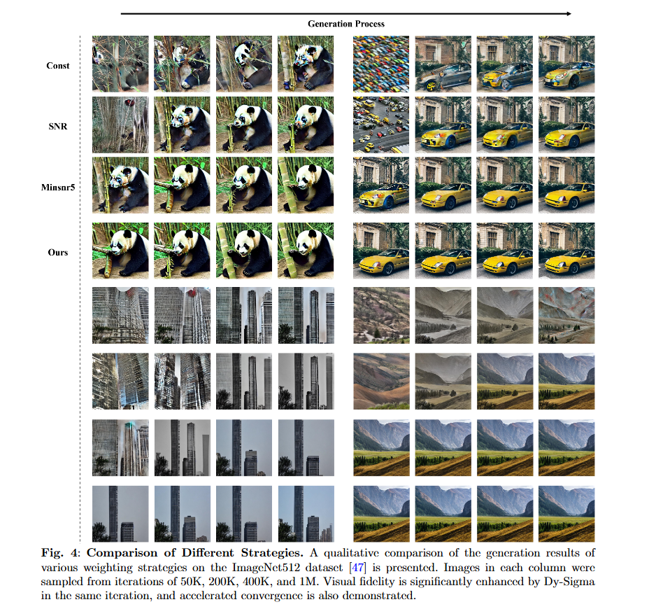

# MSDM: Multi-Space Diffusion With Dynamic Loss Weight
## OverReview
Diffusion models have achieved remarkable results in image generation. However, due to the slow convergence speed, room for enhancement remains in existing loss weight strategies. In one aspect, the predefined loss weight strategy based on signal-to-noise ratio (SNR) transforms the diffusion process into a multi-objective optimization problem. However, it takes a long time to reach the Pareto optimal. In contrast, the unconstrained optimization weight strategy can achieve lower objective values, but the loss weights of each task change unstably, resulting in low training efficiency. In addition, the imbalance of lossy compression and semantic information in latent space diffusion also leads to missing image details. To solve these problems, a new loss weight strategy combining the advantages of predefined and learnable loss weights is proposed, effectively balancing the gradient conflict of multi-objective optimization. A high-dimensional multi-space diffusion method called Multi-Space Diffusion is also introduced, and a loss function that considers both structural information and robustness is designed to achieve a good balance between lossy compression and fidelity. The experimental results indicate that the proposed model and strategy significantly enhance the convergence speed, being** 3.7 times** faster than the Const strategy, and achieve an advanced** FID = 3.35 score** on the ImageNet512.



## Features
* Multi-Space Diffusion: Divides latent variables into multiple subspaces, enhancing detail retention and semantic information capture.
* Dynamic Loss Weight (Dy-Sigma): Employs learnable variances to dynamically adjust loss weights, significantly accelerating training convergence.
* Hybrid Loss Function: Combines Structural Similarity (SSIM) and Huber loss to improve image quality.
* High-Resolution Image Generation: Achieves advanced FID scores on high-resolution datasets like ImageNet512.

##  Datasets
The following datasets are used in this project:

* \- Cifar10
* \- CelebA
* \- LSUN-Bedroom
* \- LSUN-Churches
* \- ImageNet

## Prerequisites
* \- Python 3.8 or higher
* \- CUDA-enabled GPU (recommended for training)
* \- PyTorch 2.3.1
* \- Torchvision
* \- Weights & Biases (for experiment tracking)

## Usage
### Training the Model
1. **Clone the repository**:

```Plain Text
git clone https://github.com/yourusername/msdm.git
cd msdm
```
2. **Prepare your dataset**: Ensure your datasets are correctly formatted and placed in the appropriate directories.
3. **Configure the training script**: Adjust the hyperparameters and paths in the training script (`configs\in256\vit-b_layer12_lr1e-4_099_099_pred_x0__min_snr_5__fp16_bs8x32.sh`) as needed.
4. **Run the training script**:

```Plain Text
bash vit-b_layer12_lr1e-4_099_099_pred_x0__min_snr_5__fp16_bs8x32.sh 4 32
```
### Evaluating the Model
1. **Use the evaluation script**: After training, you can evaluate the model using the evaluation script (`evaluate.py`).

## Results
The MSDM model achieves the following performance on ImageNet512:

* **FID**: 3.35
* **Convergence Speed**: 3.7 times faster than the **Const strategy**

## License
This project is licensed under the MIT License. See the LICENSE file for more details.

## Acknowledgments
This work is supported by various grants and research projects. We thank Cathal Gurrin for his valuable inputs that helped improve this work!

## Contact
For any questions or inquiries, please contact the first author via email: [2022110292@scuec.edu.cn](mailto:2022110292@scuec.edu.cn).


---


---


